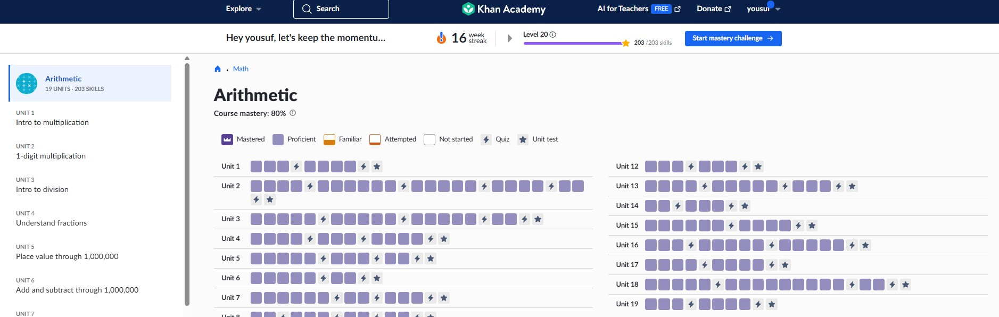

# OSSU Computer Science Progress - 2026

## Completed Courses
### High School Math
all from Khan Academy, Mastery level of 80% at least
- [✅]  Arithmetic

- [ ] Pre-Algebra
- [ ] Algebra 1
- [ ] Geometry
- [ ] Algebra 2
- [ ] Trigonometry
- [ ] PreCalculus

### Introduction to Computer Science
- [ ] Introduction to Computer Science and Programming using Python
- [ ] Systematic Program Design
- [ ] Class-based Program Design
- [ ] Programming Languages
- [ ] Object-Oriented Design
- [ ] Software Architecture
### Core Math
- [ ] Calculus 1A: Differentiation (alternative)
- [ ] Calculus 1B: Integration
- [ ] Calculus 1C: Coordinate Systems & Infinite Series
- [ ] Mathematics for Computer Science (alternative)
### CS tools
- [ ] The Missing Semester of Your CS Education
### Core systems
- [ ] Build a Modern Computer from First Principles: From Nand to Tetris (alternative)
- [ ] Build a Modern Computer from First Principles: Nand to Tetris Part II 
- [ ] Operating Systems: Three Easy Pieces 
- [ ] Computer Networking: a Top-Down Approach
### Core theory
- [ ] Algorithms: Design and Analysis, Part 1 (alternative)
- [ ] Algorithms: Design and Analysis, Part 2
### Core security
- [ ] Identifying Security Vulnerabilities in C/C++Programming
- [ ] Exploiting and Securing Vulnerabilities in Java Applications
### Core applications
- [ ] Databases: Modeling and Theory
- [ ] Databases: Relational Databases and SQL
- [ ] Databases: Semistructured Data
- [ ] Machine Learning
- [ ] Computer Graphics (alternative)
- [ ] Software Engineering: Introduction (alternative)
### Core ethics
- [ ] Ethics, Technology and Engineering
- [ ] Introduction to Intellectual Property
- [ ] Data Privacy Fundamentals
### Advanced math
- [ ] Essence of Linear Algebra
- [ ] Linear Algebra
- [ ] Introduction to Numerical Methods
- [ ] Introduction to Formal Logic
- [ ] Probability

### Final project
- [ ] Full Stack Open
## Stats
- Total courses: 41
- Completed: 1
- Percentage: 2.43%
